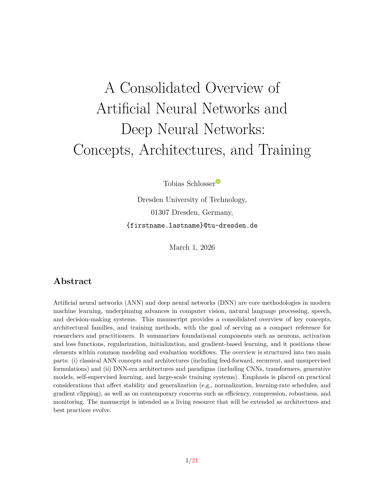

A Consolidated Overview of Artificial Neural Networks and Deep Neural Networks: Concepts, Architectures, and Training
=====================================================================================================================


By Tobias Schlosser


---

Artificial neural networks (ANN) and deep neural networks (DNN) are core methodologies in modern machine learning, underpinning advances in computer vision, natural language processing, speech, and decision-making systems. This manuscript provides a consolidated overview of key concepts, architectural families, and training methods, with the goal of serving as a compact reference for researchers and practitioners. It summarizes foundational components such as neurons, activation and loss functions, regularization, initialization, and gradient-based learning, and it positions these elements within common modeling and evaluation workflows. The overview is structured into two main parts: (i) classical ANN concepts and architectures (including feed-forward, recurrent, and unsupervised formulations) and (ii) DNN-era architectures and paradigms (including CNNs, transformers, generative models, self-supervised learning, and large-scale training systems). Emphasis is placed on practical considerations that affect stability and generalization (e.g., normalization, learning-rate schedules, and gradient clipping), as well as on contemporary concerns such as efficiency, compression, robustness, and monitoring. The manuscript is intended as a living resource that will be extended as architectures and best practices evolve.

---


Please cite the paper in your publications if it helps your research:

```
@article{Schlosser2026_networks,
  title={A Consolidated Overview of Artificial Neural Networks and Deep Neural Networks: Concepts, Architectures, and Training},
  author={Schlosser, Tobias},
  year={2026}
}
```


Compilation
-----------

```
make clean && make
```


Example
-------



