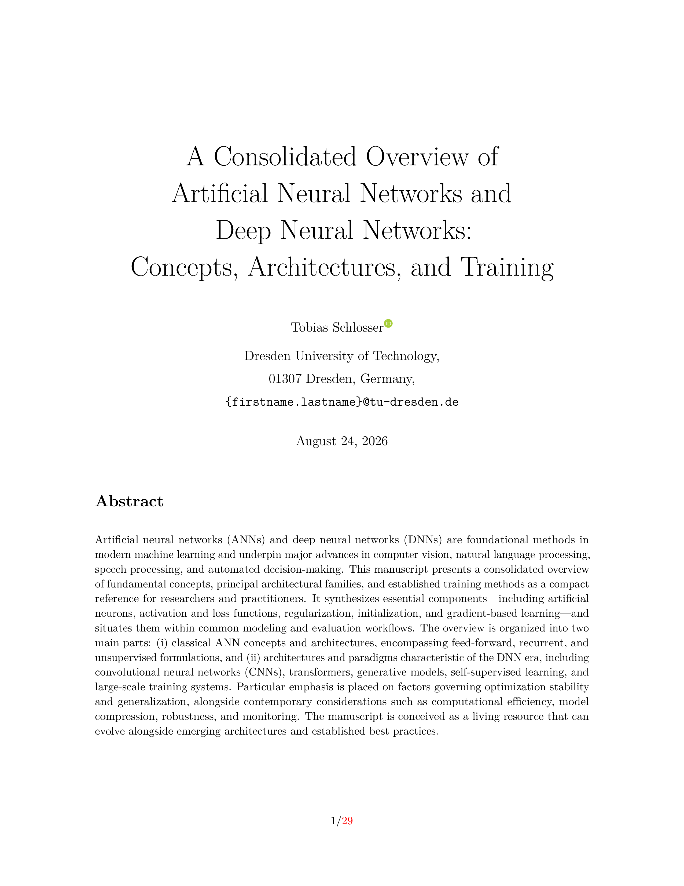

A Consolidated Overview of Artificial Neural Networks and Deep Neural Networks: Concepts, Architectures, and Training
=====================================================================================================================


By Tobias Schlosser


---

Artificial neural networks (ANNs) and deep neural networks (DNNs) are foundational methods in modern machine learning and underpin major advances in computer vision, natural language processing, speech processing, and automated decision-making. This manuscript presents a consolidated overview of fundamental concepts, principal architectural families, and established training methods as a compact reference for researchers and practitioners. It synthesizes essential components—including artificial neurons, activation and loss functions, regularization, initialization, and gradient-based learning—and situates them within common modeling and evaluation workflows. The overview is organized into two main parts: (i) classical ANN concepts and architectures, encompassing feed-forward, recurrent, and unsupervised formulations, and (ii) architectures and paradigms characteristic of the DNN era, including convolutional neural networks (CNNs), transformers, generative models, self-supervised learning, and large-scale training systems. Particular emphasis is placed on factors governing optimization stability and generalization, alongside contemporary considerations such as computational efficiency, model compression, robustness, and monitoring. The manuscript is conceived as a living resource that can evolve alongside emerging architectures and established best practices.

---


Please cite the paper in your publications if it helps your research:

```
@article{Schlosser2026_networks,
  title={A Consolidated Overview of Artificial Neural Networks and Deep Neural Networks: Concepts, Architectures, and Training},
  author={Schlosser, Tobias},
  year={2026}
}
```


Compilation
-----------

```
make clean && make
```


The manuscript
--------------



